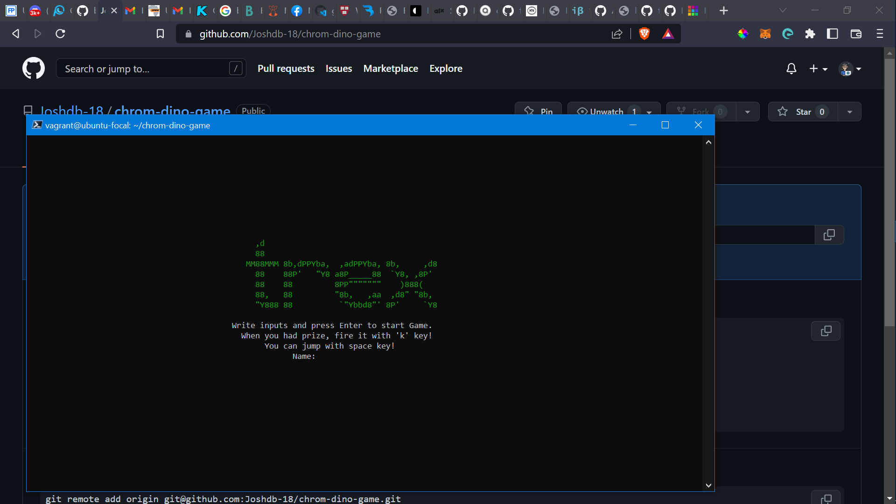
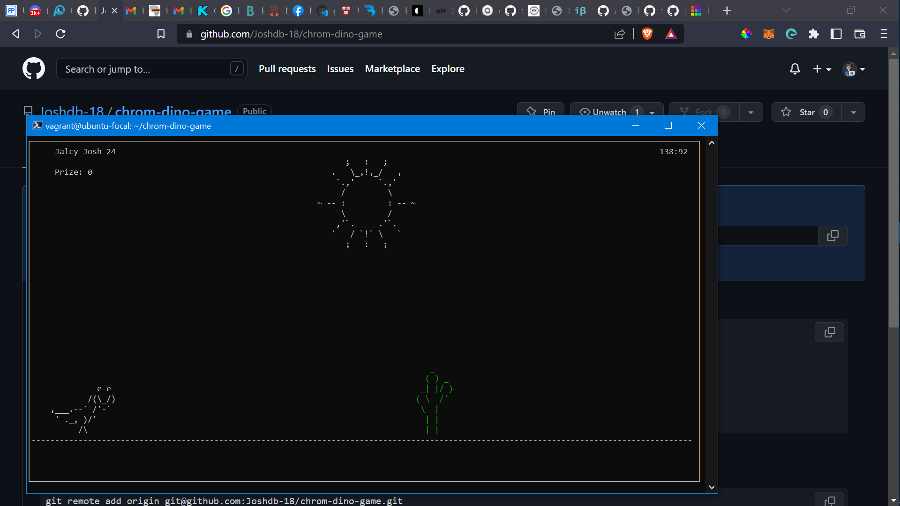
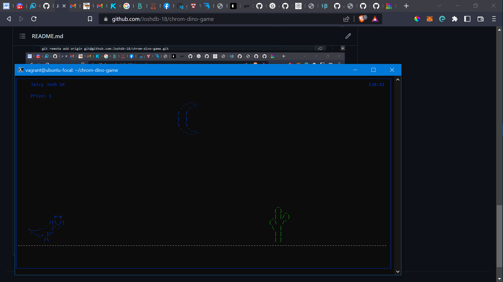
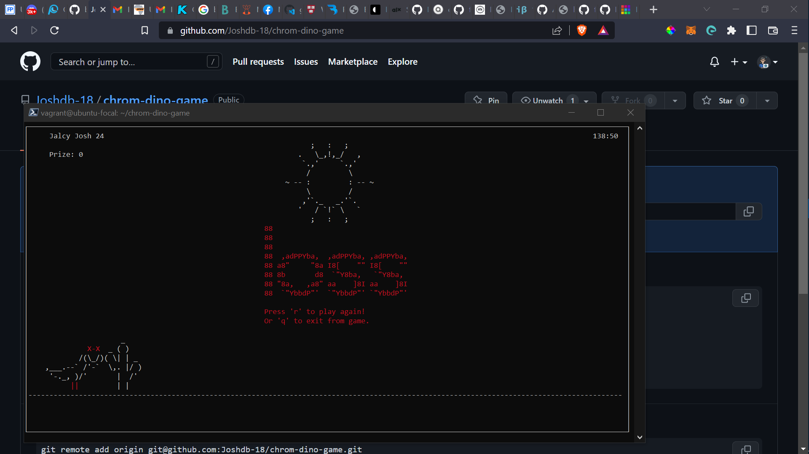

# Chrome Dinosaur
#### Google Chrome dinosaur game using Ncurses in C (T-Rex)

You can jump using the ``space`` key, and you can fire to remove obstacles when Prize is >= 1 using the ``k`` Key.

##### To compile and run:

(Make sure you have Ncurses library installed!)
To install with linux, use: ``sudo apt-get install libncurses5-dev libncursesw5-dev``

```shell
gcc main.c -lncurses -o main.out
./main.out
```





